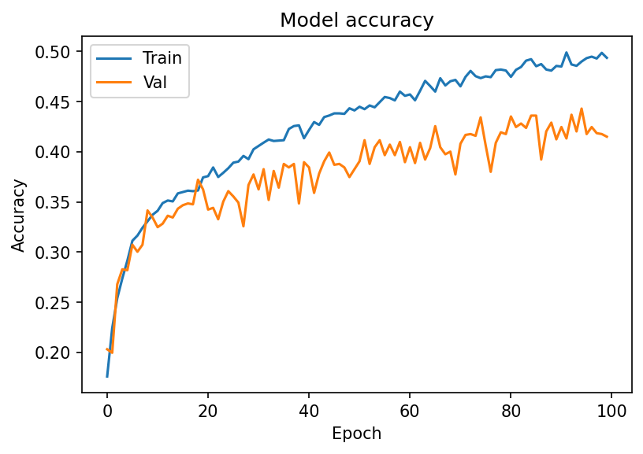
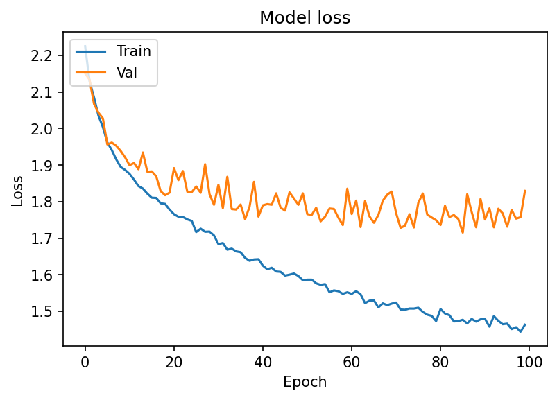
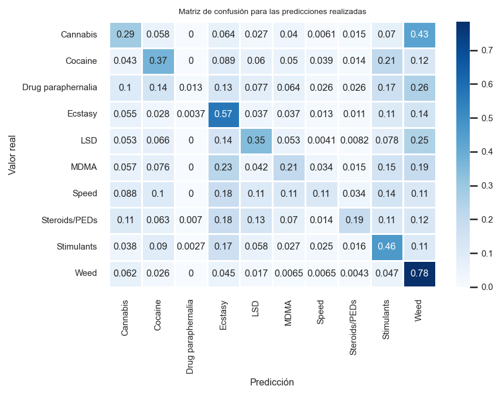
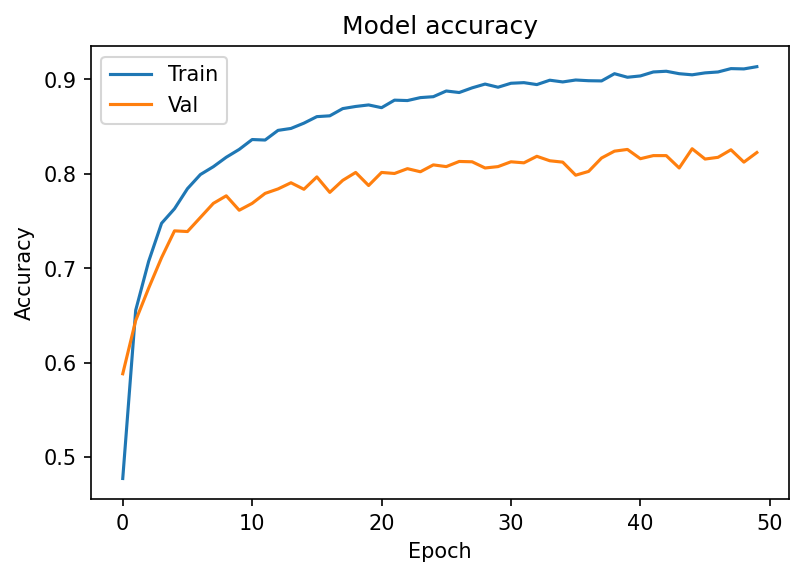
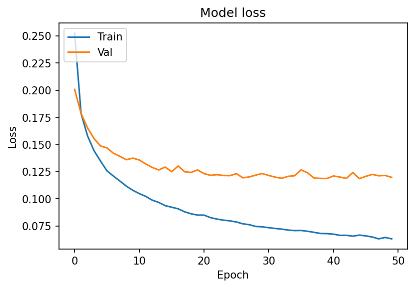
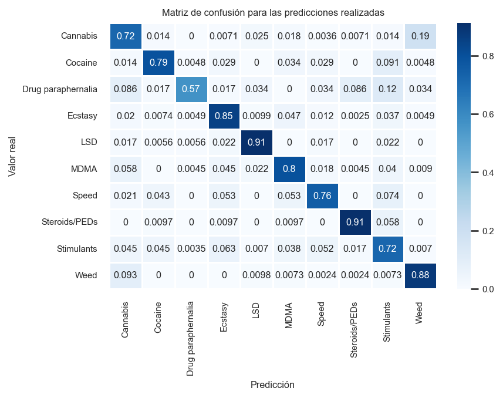

# Image classification

## Silkroad2 images dataset:

>This dataset is part of an ongoing project to scrape darkweb market listings from historical sources and eventually expand that to include contemporary listings.

Only the top 10 most present categories in the dataset will be considered in this model.

 

## Baseline model results:

Accuracy score: 0.4283

 
 

## Main model results:

Accuracy score: 0.8096

